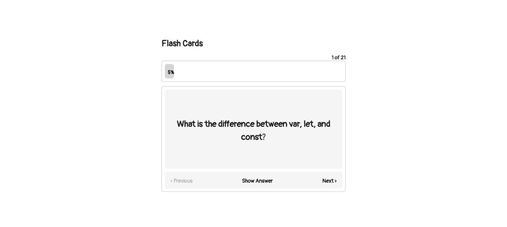
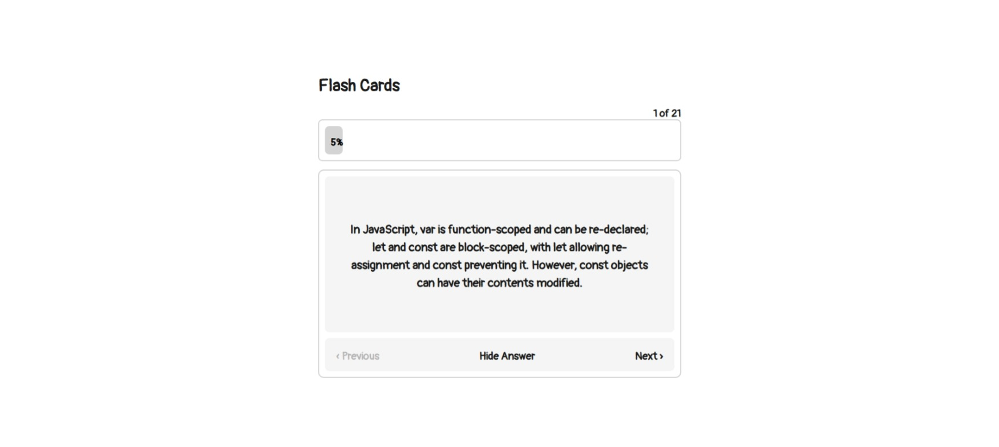
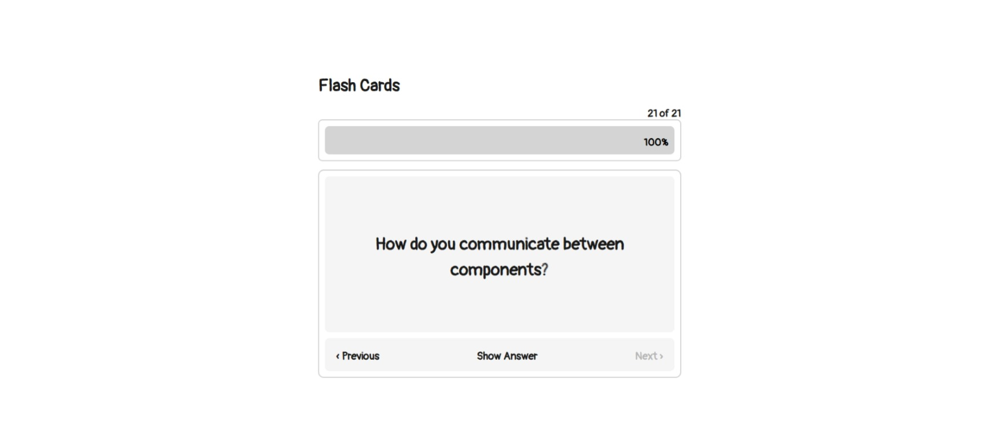

# Flash Cards App

App de flashcards com perguntas e respostas comuns em entrevistas de JavaScript e Angular.

[](https://roadmap.sh/projects/flash-cards)
[](https://angular.dev)
[](https://tailwindcss.com)

## Sobre o Projeto

Este projeto faz parte do [roadmap.sh](https://roadmap.sh) e tem como objetivo praticar **gerenciamento de estado** e **arquitetura baseada em componentes** usando frameworks JavaScript.

O app possui 21 flashcards com perguntas e respostas frequentes em entrevistas técnicas sobre JavaScript e Angular. O usuário pode navegar entre os cards, revelar/ocultar as respostas e acompanhar o progresso através de uma barra de progresso.

**🔗 Página do projeto:** [roadmap.sh/projects/flash-cards](https://roadmap.sh/projects/flash-cards)

**🌐 Site:** [viniloppes.github.io/FlashcardsApp](https://viniloppes.github.io/FlashcardsApp)

**👤 Autor:** [Vinicius Lopes](https://github.com/viniloppes)

##  Screenshots

| Pergunta | Resposta | Última Questão |
| :---: | :---: | :---: |
|  |  |  |

##  Funcionalidades

- 21 flashcards com perguntas de entrevistas (JavaScript & Angular)
- 🔄 Flip para revelar/ocultar a resposta
- ⬅️➡️ Navegação entre cards (Previous / Next)
- Barra de progresso com porcentagem
- Contador de cards (ex: 1 of 21)
- Arquitetura zoneless com Signals para gerenciamento de estado

## Tecnologias

- **Framework:** Angular 21
- **Linguagem:** TypeScript 5.9
- **Estilização:** Tailwind CSS 4 + CSS customizado
- **State Management:** Angular Signals
- **Fonte:** Pangolin (Adobe Fonts)

## Como Executar

### Pré-requisitos

- [Node.js](https://nodejs.org) (v20+)
- [Angular CLI](https://angular.dev/tools/cli) (v21+)

### Instalação

```bash
# Clone o repositório
git clone https://github.com/viniloppes/FlashcardsApp.git

# Entre no diretório
cd FlashcardsApp

# Instale as dependências
npm install
```

### Servidor de Desenvolvimento

```bash
ng serve
```

Abra o navegador em `http://localhost:4200/`. O app recarrega automaticamente ao modificar qualquer arquivo.

### Build de Produção

```bash
ng build
```

Os artefatos de build serão salvos no diretório `dist/`.

## 📁 Estrutura do Projeto

```
src/
├── app/
│   ├── decks/
│   │   ├── deck-card/          # Componente do card (pergunta/resposta)
│   │   ├── deck-list/          # Componente principal com lógica e navegação
│   │   └── deck-progress-bar/  # Barra de progresso
│   ├── app.ts                  # Componente raiz
│   └── app.module.ts           # Módulo principal
├── assets/
│   └── screenshots/            # Screenshots do app
└── styles.css                  # Estilos globais + Tailwind
```

## Data de Criação

28 de Abril de 2026

---

<p align="center">
  Feito por <a href="https://github.com/viniloppes">Vinicius Lopes</a> como parte do <a href="https://roadmap.sh">roadmap.sh</a>
</p>
